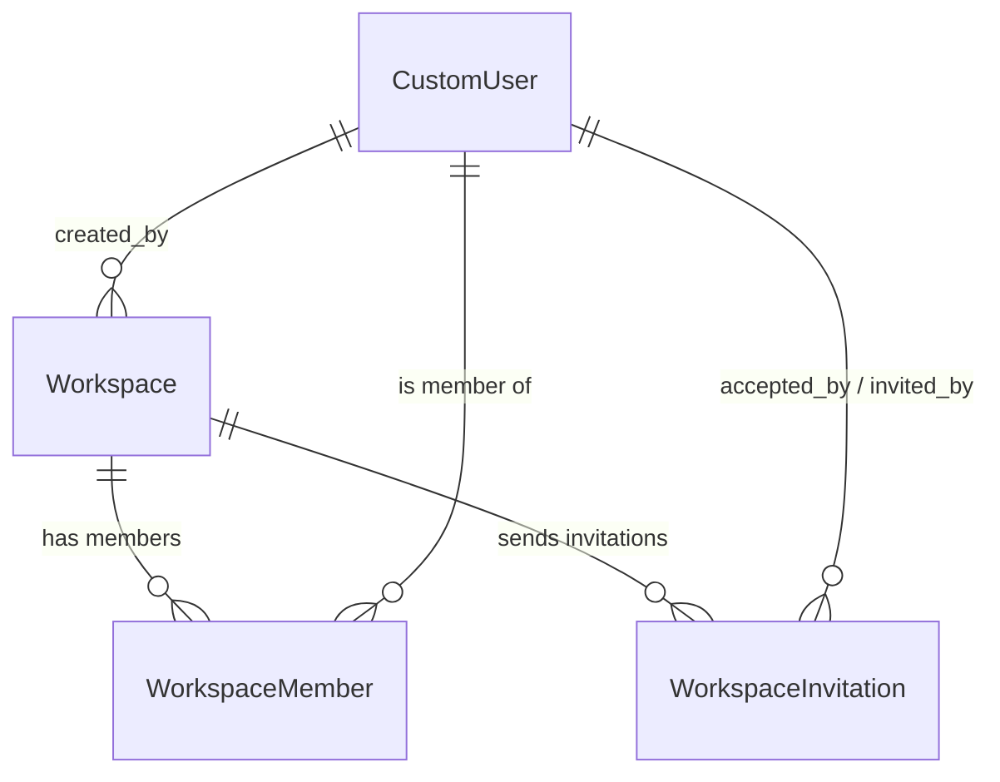
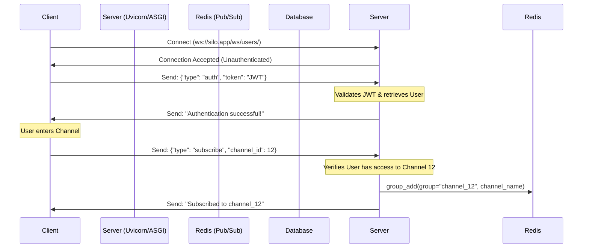
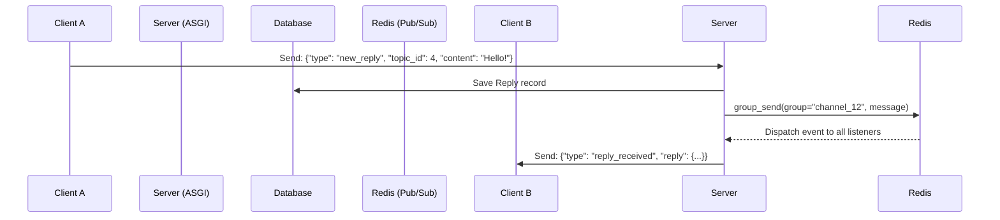
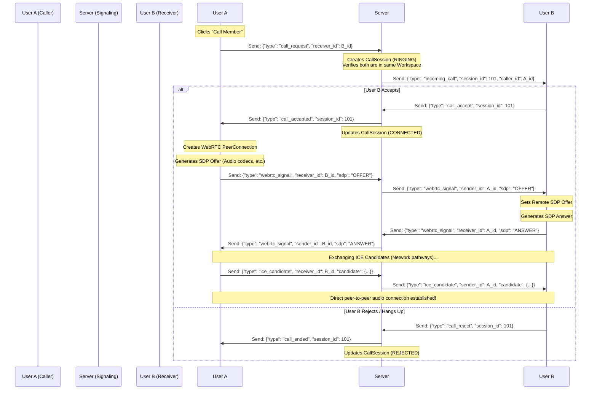
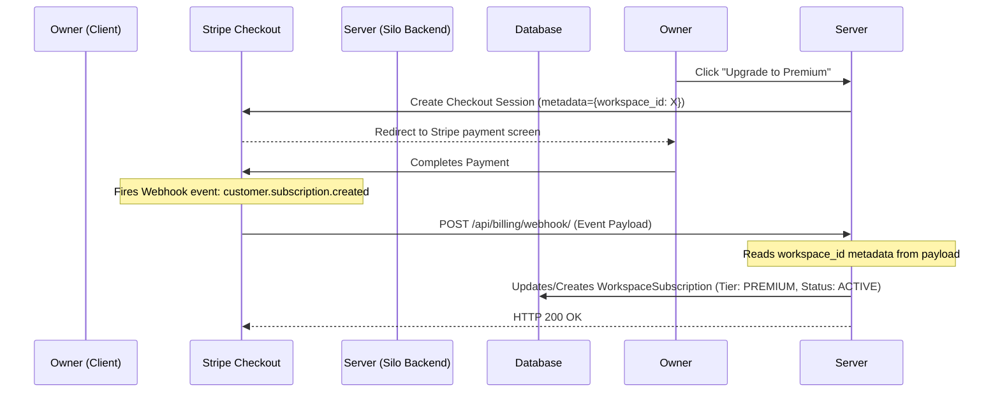

# Silo Database Schema Design (Workspaces & Roles)

This document contains the proposed database model structure to support user-created organizations/workspaces, role-based memberships (Owner, Admin, Member, Guest), and invitation systems.

## Schema Relationship Diagram



---

## Django Models Specification

Add these models to your Django application (e.g. in a new `apps/workspaces` app or inside your existing app).

### 1. Workspace
Represents a tenant or organization.
```python
from django.db import models
from django.conf import settings

class Workspace(models.Model):
    name = models.CharField(max_length=100)
    slug = models.SlugField(unique=True)  # E.g., 'acme-corp' for subdomain/url pathing
    created_at = models.DateTimeField(auto_now_add=True)
    created_by = models.ForeignKey(
        settings.AUTH_USER_MODEL, 
        on_delete=models.SET_NULL, 
        null=True, 
        related_name="created_workspaces"
    )

    def __str__(self):
        return self.name
```

### 2. Workspace Member (Roles)
Acts as a join table linking Users to Workspaces with their respective permission roles.
```python
class WorkspaceMember(models.Model):
    class Role(models.TextChoices):
        OWNER = 'OWNER', 'Owner'      # Can delete workspace, manage billing, invite admins
        ADMIN = 'ADMIN', 'Admin'      # Can create/delete channels, invite members
        MEMBER = 'MEMBER', 'Member'  # Normal user (read/write in public channels)
        GUEST = 'GUEST', 'Guest'      # Limited access to specific channels/docs

    workspace = models.ForeignKey(Workspace, on_delete=models.CASCADE, related_name='memberships')
    user = models.ForeignKey(settings.AUTH_USER_MODEL, on_delete=models.CASCADE, related_name='workspaces')
    role = models.CharField(max_length=20, choices=Role.choices, default=Role.MEMBER)
    joined_at = models.DateTimeField(auto_now_add=True)

    class Meta:
        unique_together = ('workspace', 'user')  # One membership row per user-workspace pair

    def __str__(self):
        return f"{self.user.email} in {self.workspace.name} ({self.role})"
```

### 3. Workspace Invitation
Manages the lifecycle of invitation link tokens.
```python
import uuid
from datetime import timedelta
from django.utils import timezone

class WorkspaceInvitation(models.Model):
    workspace = models.ForeignKey(Workspace, on_delete=models.CASCADE, related_name='invitations')
    email = models.EmailField()
    invited_by = models.ForeignKey(
        settings.AUTH_USER_MODEL, 
        on_delete=models.CASCADE, 
        related_name='sent_invitations'
    )
    role = models.CharField(
        max_length=20, 
        choices=WorkspaceMember.Role.choices, 
        default=WorkspaceMember.Role.MEMBER
    )
    token = models.UUIDField(default=uuid.uuid4, unique=True, editable=False)
    created_at = models.DateTimeField(auto_now_add=True)
    expires_at = models.DateTimeField()
    is_accepted = models.BooleanField(default=False)
    accepted_by = models.ForeignKey(
        settings.AUTH_USER_MODEL, 
        on_delete=models.SET_NULL, 
        null=True, 
        blank=True, 
        related_name='accepted_invitations'
    )

    def save(self, *args, **kwargs):
        # Set expiration to 7 days by default if not specified
        if not self.expires_at:
            self.expires_at = timezone.now() + timedelta(days=7)
        super().save(*args, **kwargs)

    def is_expired(self):
        return timezone.now() > self.expires_at

    def __str__(self):
        return f"Invite to {self.email} for {self.workspace.name}"
```

---

## Threaded Channels, Topics & Replies Schema

To support Slack-like channels with a Topic-centric thread structure (similar to your "engineering" page wireframe), we introduce three models:

### 4. Channel
Channels exist inside a Workspace. They are strictly **exclusive to members of that workspace**. 

* **Public Channels**: Accessible to all members of the workspace.
* **Private Channels**: Restricted only to explicitly added workspace members via the `allowed_members` relation.

```python
class Channel(models.Model):
    workspace = models.ForeignKey(Workspace, on_delete=models.CASCADE, related_name='channels')
    name = models.CharField(max_length=100)
    description = models.TextField(blank=True, default='')
    is_private = models.BooleanField(default=False)
    
    # Private Channel Access List (linking to workspace membership records)
    allowed_members = models.ManyToManyField(
        'WorkspaceMember', 
        blank=True, 
        related_name='allowed_private_channels'
    )
    
    created_at = models.DateTimeField(auto_now_add=True)
    created_by = models.ForeignKey(
        settings.AUTH_USER_MODEL, 
        on_delete=models.SET_NULL, 
        null=True, 
        related_name="created_channels"
    )

    class Meta:
        unique_together = ('workspace', 'name')  # Channel names must be unique within a workspace

    def __str__(self):
        return f"#{self.name} in {self.workspace.name}"
```

#### Access Control Rules:
1. **Workspace Exclusivity Constraint**: To view/access *any* channel or topic within a workspace, the user must have an active `WorkspaceMember` record for that workspace.
2. **Private Channel Constraint**: If `channel.is_private` is `True`, the user's `WorkspaceMember` record must exist in `channel.allowed_members.all()`.

### 5. Topic (Discussion Thread Owner)
Topics represent the main discussion threads within a channel (e.g. "Fix PostgreSQL connection leak").
```python
class Topic(models.Model):
    class Status(models.TextChoices):
        ACTIVE = 'ACTIVE', 'Active'
        RESOLVED = 'RESOLVED', 'Resolved'
        CLOSED = 'CLOSED', 'Closed'

    channel = models.ForeignKey(Channel, on_delete=models.CASCADE, related_name='topics')
    title = models.CharField(max_length=255)
    content = models.TextField()  # Initial message or description of the issue
    status = models.CharField(max_length=20, choices=Status.choices, default=Status.ACTIVE)
    created_at = models.DateTimeField(auto_now_add=True)
    updated_at = models.DateTimeField(auto_now=True)
    created_by = models.ForeignKey(
        settings.AUTH_USER_MODEL, 
        on_delete=models.SET_NULL, 
        null=True, 
        related_name="created_topics"
    )

    def __str__(self):
        return f"{self.title} (Topic in #{self.channel.name})"
```

### 6. Reply
Replies represent comments nested under a specific Topic thread.
```python
class Reply(models.Model):
    topic = models.ForeignKey(Topic, on_delete=models.CASCADE, related_name='replies')
    content = models.TextField()
    created_at = models.DateTimeField(auto_now_add=True)
    updated_at = models.DateTimeField(auto_now=True)
    created_by = models.ForeignKey(
        settings.AUTH_USER_MODEL, 
        on_delete=models.SET_NULL, 
        null=True, 
        related_name="replies"
    )

    class Meta:
        verbose_name_plural = "Replies"

    def __str__(self):
        return f"Reply by {self.created_by.email} on thread '{self.topic.title[:20]}...'"
```

---

## WebSocket Channel Broadcasting (Real-Time Engine)

To power the messaging and topics inside channels with real-time updates, Django Channels leverages **Redis Channel Layers** for pub/sub broadcasting.

### 1. Connection & Subscription Lifecycle



### 2. Live Message Flow (Posting & Broadcasting)

When a member publishes a new Topic or Reply, the message is stored in the database and immediately broadcasted to all connected clients in the channel group:



### 3. Backend Subscription Implementation

Update your `UserConsumer` to listen to dynamically joined groups.

```python
class UserConsumer(AsyncWebsocketConsumer):
    # ... (existing connect, auth, and disconnect logic) ...

    async def receive(self, text_data):
        # Ensure user is authenticated before routing messages
        if not self.authenticated:
            return

        try:
            data = json.loads(text_data)
        except json.JSONDecodeError:
            return

        action_type = data.get("type")

        # Handle channel subscription
        if action_type == "subscribe":
            channel_id = data.get("channel_id")
            # Verify if user belongs to the channel's workspace / allowed private members
            has_access = await self.verify_channel_access(channel_id)
            
            if has_access:
                self.current_channel_group = f"channel_{channel_id}"
                # Add this client connection to the Redis group
                await self.channel_layer.group_add(
                    self.current_channel_group,
                    self.channel_name
                )
                await self.send(text_data=json.dumps({
                    "status": "success",
                    "message": f"Subscribed to channel {channel_id}"
                }))
            else:
                await self.send(text_data=json.dumps({
                    "status": "error",
                    "message": "Access denied to channel"
                }))

        # Handle new reply broadcast
        elif action_type == "new_reply":
            # Save to database asynchronously
            reply_data = await self.save_reply(data)
            
            if reply_data and hasattr(self, 'current_channel_group'):
                # Broadcast the message to everyone in the group
                await self.channel_layer.group_send(
                    self.current_channel_group,
                    {
                        "type": "channel_message",
                        "message": reply_data
                    }
                )

    # Receive message from channel group
    async def channel_message(self, event):
        message = event["message"]
        # Send message to client
        await self.send(text_data=json.dumps({
            "type": "message",
            "data": message
        }))
```

---

## Schema Verification & Performance Optimizations

During our verification of this schema, we identified three key performance optimizations and integrity updates for your production implementation:

### 1. Topic Activity Sorting (`last_reply_at`)
For the chat sidebar to correctly sort topics by latest activity (just like Slack/Discord/forums), we should add a indexed datetime field to the `Topic` model.
```python
# Add to Topic model:
last_reply_at = models.DateTimeField(db_index=True, auto_now_add=True)
```
Whenever a `Reply` is created, update `last_reply_at` of the parent `Topic` using a Django post-save signal or inside the reply `save()` method.

### 2. Denormalized Reply Counts (`replies_count`)
Your frontend design shows reply count counts next to topics (e.g. `14 replies →`). Running SQL count queries over large datasets on-the-fly will slow down dashboard rendering. 
```python
# Add to Topic model:
replies_count = models.PositiveIntegerField(default=0)
```
Increment this counter dynamically when saving new replies.

### 3. Invitation Uniqueness Constraint
To prevent sending duplicate active invitations to the same email address for a single workspace, we should restrict duplicate rows in the `WorkspaceInvitation` model:
```python
class Meta:
    unique_together = ('workspace', 'email')
```
This forces clean management of invitations (invoking resend instead of duplicate record creation).

### 4. Cascade Safeguards (Verified)
Our schema uses `on_delete=models.SET_NULL` on all `created_by` relationships. This is **correct and secure**. If a user deactivates or deletes their account, their created workspaces, channels, topics, and replies will remain intact with an anonymous/deleted user placeholder, protecting the workspace historical data from cascade deletion.

---

## P2P Voice Calling & WebRTC Signaling

For peer-to-peer (P2P) voice calls between exactly 2 workspace members, the media (audio) stream travels directly between the two users' browsers using **WebRTC**. However, the browsers need your Django Channels WebSocket server as a **Signaling Channel** to discover each other and negotiate the connection.

### 1. Call History Database Model (`CallSession`)
To keep track of call logs, call durations, and status (missed, completed, rejected), add a `CallSession` model:

```python
class CallSession(models.Model):
    class Status(models.TextChoices):
        RINGING = 'RINGING', 'Ringing'
        CONNECTED = 'CONNECTED', 'Connected'
        MISSED = 'MISSED', 'Missed'
        REJECTED = 'REJECTED', 'Rejected'
        COMPLETED = 'COMPLETED', 'Completed'

    workspace = models.ForeignKey(Workspace, on_delete=models.CASCADE, related_name='calls')
    caller = models.ForeignKey(
        settings.AUTH_USER_MODEL, 
        on_delete=models.SET_NULL, 
        null=True, 
        related_name="initiated_calls"
    )
    receiver = models.ForeignKey(
        settings.AUTH_USER_MODEL, 
        on_delete=models.SET_NULL, 
        null=True, 
        related_name="received_calls"
    )
    status = models.CharField(max_length=20, choices=Status.choices, default=Status.RINGING)
    
    started_at = models.DateTimeField(null=True, blank=True)
    ended_at = models.DateTimeField(null=True, blank=True)
    duration_seconds = models.PositiveIntegerField(default=0)  # Saved on completion
    
    class Meta:
        ordering = ['-started_at']

    def __str__(self):
        return f"Call in {self.workspace.name}: {self.caller.email} -> {self.receiver.email} ({self.status})"
```

### 2. WebRTC Signaling Flow Sequence

The WebSocket acts as a signaling post office. The server does not process or relay any audio; it simply routes negotiation events between the two users:



---

## SaaS Monetization & Stripe Subscriptions (Member Limit Guard)

To monetize Silo as a SaaS (Software-as-a-Service), we enforce a **billing tier limit**: workspaces are free for up to **2 members** (e.g. 1 Owner + 1 Member). To add a 3rd member or invite more, the workspace must have an active paid subscription.

### 1. Subscription Database Model (`WorkspaceSubscription`)

Add a model to track the billing state of each workspace.

```python
class WorkspaceSubscription(models.Model):
    class Tier(models.TextChoices):
        FREE = 'FREE', 'Free'
        PREMIUM = 'PREMIUM', 'Premium'

    class Status(models.TextChoices):
        ACTIVE = 'ACTIVE', 'Active'
        PAST_DUE = 'PAST_DUE', 'Past Due'
        CANCELED = 'CANCELED', 'Canceled'
        UNPAID = 'UNPAID', 'Unpaid'

    workspace = models.OneToOneField(
        Workspace, 
        on_delete=models.CASCADE, 
        related_name='subscription'
    )
    tier = models.CharField(max_length=20, choices=Tier.choices, default=Tier.FREE)
    status = models.CharField(max_length=20, choices=Status.choices, default=Status.ACTIVE)
    
    # Stripe Integration Fields
    stripe_customer_id = models.CharField(max_length=255, blank=True, null=True)
    stripe_subscription_id = models.CharField(max_length=255, blank=True, null=True)
    
    current_period_end = models.DateTimeField(blank=True, null=True)
    created_at = models.DateTimeField(auto_now_add=True)
    updated_at = models.DateTimeField(auto_now=True)

    def is_premium(self):
        return self.tier == self.Tier.PREMIUM and self.status == self.Status.ACTIVE

    def __str__(self):
        return f"Subscription for {self.workspace.name}: {self.tier} ({self.status})"
```

### 2. Business Logic: Member Limit Guard

Before sending an invitation or adding a user to a workspace, check the subscription tier and current active member count:

```python
from django.core.exceptions import PermissionDenied

def verify_member_limit_guard(workspace):
    # Fetch subscription or default to Free
    try:
        sub = workspace.subscription
    except WorkspaceSubscription.DoesNotExist:
        sub = WorkspaceSubscription.objects.create(workspace=workspace, tier=WorkspaceSubscription.Tier.FREE)

    # If the workspace is on the Free tier
    if not sub.is_premium():
        active_member_count = workspace.memberships.count()
        
        # Block invitations/memberships if limit of 2 is exceeded
        if active_member_count >= 2:
            raise PermissionDenied(
                "This workspace has reached the limit of 2 members allowed on the Free plan. "
                "Please upgrade your subscription to invite more members."
            )
```

### 3. Stripe Integration Event Flow (Webhooks)

We handle checkout upgrades and subscription cancels asynchronously via Stripe Webhooks:



---

## Subscription Plans & Autopay (Auto-Renew) Architecture

### 1. Detailed Subscription Plan Tiers

We offer two distinct subscription tiers for workspaces:

| Feature / Metric | **Free Tier** | **Premium Tier** |
| --- | --- | --- |
| **Pricing** | **$0** (Free Forever) | **$8 / user / month** (or $29/mo flat) |
| **Workspace Members** | Max **2 members** (e.g. 1 Owner + 1 Member) | **Unlimited** members |
| **Threaded Channels** | Unlimited public & private channels | Unlimited public & private channels |
| **P2P Voice Calls** | Free (WebRTC peer-to-peer audio) | Unlimited |
| **Document Collaboration** | Local-only auto-sync (IndexedDB) | Real-time cloud sync & version history |

---

### 2. Autopay (Auto-Renew) Implementation

Stripe handles autopay by default for recurring subscriptions using the customer's saved payment method. To let users toggle **Autopay ON or OFF** (cancel at the end of the period):

1. **Add `auto_renew` Field**:
   Add a boolean status field to track the renewal preference.
   ```python
   # Add to WorkspaceSubscription model:
   auto_renew = models.BooleanField(default=True)
   ```

2. **Toggling Autopay in Stripe (Cancel at Period End)**:
   * **Autopay OFF**: When the user turns off autopay, we tell Stripe to cancel the subscription *at the end of the current billing cycle* rather than renewing:
     ```python
     stripe.Subscription.modify(
         subscription_id,
         cancel_at_period_end=True  # Stops automatic renewal/autopay
     )
     # In our database, set auto_renew = False
     ```
   * **Autopay ON**: To re-enable autopay before the expiration date:
     ```python
     stripe.Subscription.modify(
         subscription_id,
         cancel_at_period_end=False  # Re-enables automatic renewal/autopay
     )
     # In our database, set auto_renew = True
     ```

3. **Webhook Syncing**:
   If a card charge fails on renewal (Stripe triggers `invoice.payment_failed` after several retry attempts), Stripe will trigger a webhook to change the status to `past_due` or `unpaid`. Our webhook receiver updates the database status field to reflect that the Premium benefits are suspended until payment is resolved.


